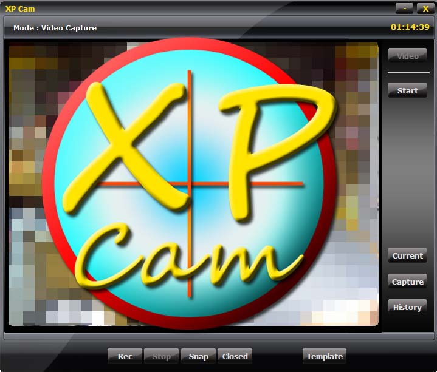

## XPCam

### Description

XPCam - another webcam program in VB

' - Custom define detection zone /region(s)

' - Alert with Wave file(s)

' - Capture detected image file

' - Capture video with capCreateCaptureWindow api function

' - Play Avi with mciSendString api function

' - Capture photo with frame template

' - video cam option source and format setting
 
### More Info
 

             |
---                |---
**Submitted On**   |2009-05-14 13:33:38
**By**             |[Tmax](https://github.com/Planet-Source-Code/PSCIndex/blob/master/ByAuthor/tmax.md)
**Level**          |Advanced
**User Rating**    |5.0 (40 globes from 8 users)
**Compatibility**  |VB 6\.0
**Category**       |[Miscellaneous](https://github.com/Planet-Source-Code/PSCIndex/blob/master/ByCategory/miscellaneous__1-1.md)
**World**          |[Visual Basic](https://github.com/Planet-Source-Code/PSCIndex/blob/master/ByWorld/visual-basic.md)
**Archive File**   |[XPCam2152415152009\.zip](https://github.com/Planet-Source-Code/tmax-xpcam__1-72091/archive/master.zip)

